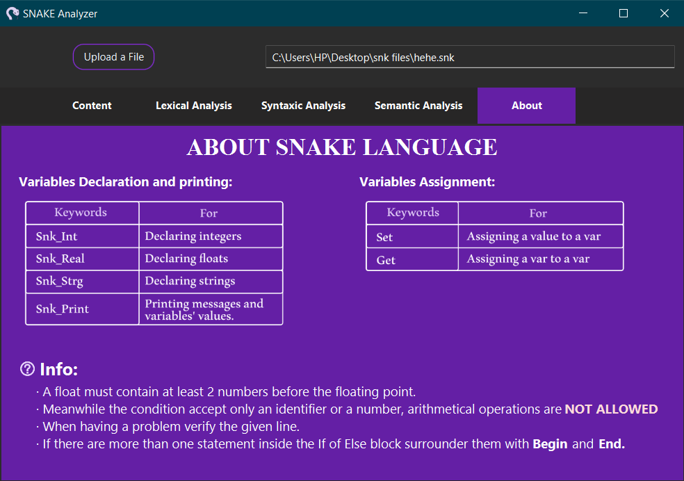

# SNAKE Compiler

**THE OBJECTIVE:**

Developping a compiler that has the ability to analyze a source file **.snk** written using a -made in- language called **SNAKE**

**LEXICAL ANALYSIS**

All tokens must be recognized

**SYNTAX ANALYSIS**

Syntaxic errors must be signaled in case one or multiple instructions weren't following the right format

**SEMANTIC  ANALYSIS**

Semantic errors must be printed such as; incompatible types, using an undeclared variable and so on

# SNAKE SPECIFICATIONS

* The program must start with **Snk_Begin** and ends with **Snk_End.**
* Only **ONE** instruction per line
* An instruction must ends with **#**.
* A comment must start with **##.**
* An identifier must start with a letter and can be followed by alphanumeric characters.
* **Snk_Int** for declaring integers.
* **Snk_Real** for declaring floats.
* **Snk_Strg** for declaring strings.
* A float is composed of 2 integers separated by a point.
* A string must be inside double quotes (**" "**).

# Front-End Exploration

